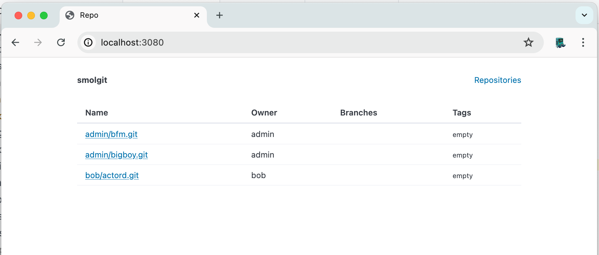
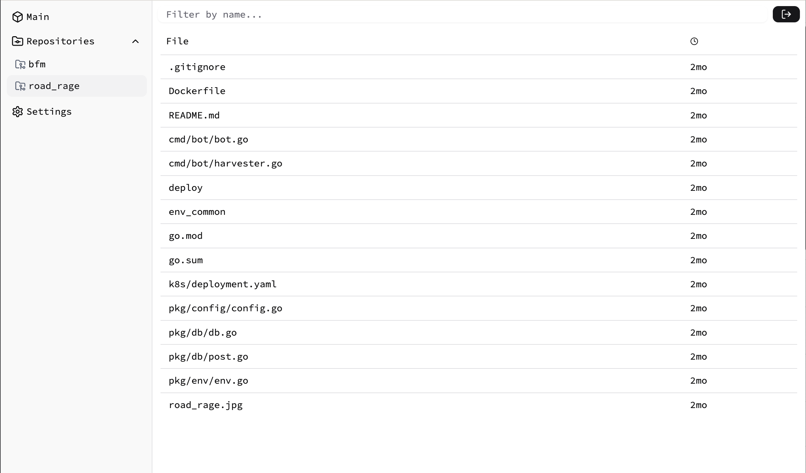

**smolgit** offers a minimalist [git](https://git-scm.com/) server, making it perfect for small teams or individual developers. Its minimal simple and just works. Small memory footprint, one binary to go. No fancy pancy javascript frameworks.

<!-- toc -->
- [Motivation](#motivation)
- [Usage](#usage)
  - [Preview](#preview)
- [Getting Started](#getting-started)
  - [Install](#install)
  - [Run](#run)
  - [Config](#config)
- [Prerequisites](#prerequisites)
- [Built with](#built-with)
- [Contribution](#contribution)
<!-- /toc -->

### Motivation
**smolgit** is perfect for those who value simplicity and efficiency in their workflow. The goal is to eliminate the bloat and offer a tool that is easy to set up, use, and maintain.

### Usage

1. **git operations**: Easily perform `pull`, `push`, `clone` and `fetch` operations.
1. **repository visualization**: Browse files, view logs, explore the commit and branch and tag lists.
1. **user management**: Simple user management, add users with `ssh-keys` to `config.yaml`.

### Preview

<p align="center">
   
</p>
<p align="center">
   
</p>


### Getting Started

#### Install

1. Download binary from [ release page ](https://github.com/roman-kiselenko/smolgit/releases).
1. Generate default `config.yaml` file with command `./smolgit config > config.yaml`.
    - Use [`yq`](https://github.com/mikefarah/yq) for inline changes `./smolgit config | yq '.server.disabled = true' > config.yaml`
1. Run `./smolgit`

```shell
$> ./smolgit
10:08AM INF set loglevel level=DEBUG
10:08AM INF version version=main-a4f6438
10:08AM INF initialize web server addr=:3080
10:08AM INF initialize ssh server addr=:3081
10:08AM INF start server brand=smolgit address=:3080
10:08AM INF starting SSH server addr=:3081
```

#### Config

Generate default `config.yaml` file with command `./bin/smolgit config > config.yaml`.

```yaml
log:
  # Color log output
  color: true
  # Log as json
  json: false
  # Log level (INFO, DEBUG, TRACE, WARN)
  level: DEBUG
server:
  # Disable web server
  disabled: false
  # Enable basic http auth
  auth:
    enabled: false
    # Credentials for basic auth
    accounts:
      - login: user2
        password: bar
      - login: user1
        password: foo
  # Web server address
  addr: ":3080"
  # Navbar brand string
  brand: "smolgit"
ssh:
  # SSH server address
  addr: ":3081"
git:
  # Folder to save git repositories
  path: /tmp/smolgit
  # Base for clone string formating
  # (e.g. ssh://git@my-git-server.lan/myuser/project.git)
  base: "git@my-git-server.lan"
  users:
    # User name used for folder in git.path
  - name: "bob"
    # Permissions, wildcard or regex
    # User to check access for other repositories
    # '*' - access for all repositories
    # 'admin' - access for admin's repositories
    # '(admin|billy)' - access for admin's and billy's repositories
    permissions: "*"
    keys:
    - ssh-rsa AAAAB3NzaC1yc2EAAAADAQABAAABgQCq9rD9b8tYyuSLsTECHCn... developer@mail.com
```

cli options:

```shell
$> ./smolgit --help
Usage of ./smolgit:
  -config string
        path to config (default "./config.yaml")
```

### Prerequisites

- git

### Built with

:heart:

- [golang](https://go.dev/)
- [gin](https://github.com/gin-gonic/gin)
- [go-git](https://github.com/go-git/go-git)
- [pico](https://picocss.com/docs)
- [gossh](https://github.com/gliderlabs/ssh)

### Contribution

Contributions are more than welcome! Thank you!
